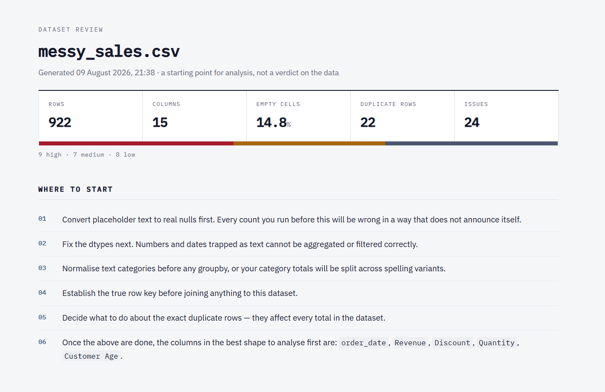
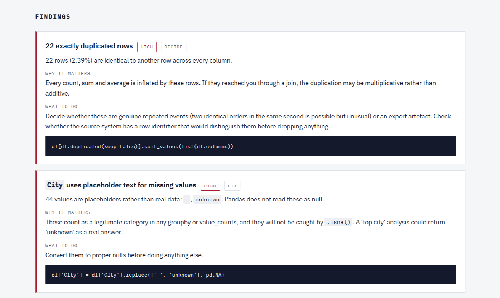

# 🔍 Dataset Review Agent — Automated Data Quality Assessment


A Python tool that reads a CSV or Excel file, works out what each column
actually holds, finds the problems that will quietly distort an analysis, and
writes a report saying what to deal with first — so you can understand a
dataset without inspecting it row by row.

## 📘 Background

Every analysis starts the same way: someone hands you a file, and the first
hour goes on finding out what is wrong with it. Numbers stored as text. The
same city spelled four ways. An "ID" column that turns out not to be unique. A
`999` sitting in a quantity column because someone needed a value for
"unknown".

None of these announce themselves. They produce results that look perfectly
reasonable and are wrong. A `groupby` on an uncleaned city column returns three
separate cities where there is one, and nothing in the output says so.

Profiling libraries already compute the statistics. What they do not do is
judge them. `ydata-profiling` will report that a column has 214 distinct
values; it will not tell you that 125 of them are duplicates in different
capitalisation, that this splits every aggregation you run, and that you should
normalise before going further.

That judgment — the part an analyst supplies from experience — is what this
project automates.

## 🎯 Objective

1. **Profile** any CSV or Excel file: shape, types, missingness, uniqueness,
   distributions, duplicates.
2. **Diagnose** the problems that will actually affect an analysis, ranked by
   whether they block results rather than by how odd the number looks.
3. **Separate mechanical fixes from judgment calls** — give concrete code for
   the unambiguous ones, and ask a question rather than issue an instruction
   where the right answer depends on domain knowledge the tool does not have.
4. **Produce a starting direction**, not just a description: an ordered list of
   what to do first, and which columns are in good enough shape to analyse.
5. Validate the detection logic against data with **known planted problems**,
   so the checks can be measured rather than eyeballed.

## 🗂️ Dataset

Two sample files ship with the project, both built by
[`generate_messy_sample.py`](generate_messy_sample.py), so every check can be
verified against a known answer.

**`samples/messy_sales.csv`** — 922 rows × 15 columns, problems planted
deliberately:

| Column | Stored as | Planted problem |
|---|---|---|
| `Order ID` | `VARCHAR` | 18 duplicated identifiers — breaks joins |
| `order_date` | `VARCHAR` | Dates as text, mixed formats, 6 impossible future dates |
| `City` | `VARCHAR` | Four spellings of each city; `unknown` and `-` as missing |
| `Revenue` | `VARCHAR` | Currency strings (`$1,836.47`), `N/A` for missing |
| `Discount` | `VARCHAR` | Percentages stored as text (`17.8%`) |
| `Quantity` | `FLOAT` | `-1` (return code) and `999` (unknown) used as sentinels |
| `Customer Age` | `FLOAT` | 14% missing, plus impossible ages `0` and `217` |
| `Is Member` | `VARCHAR` | Boolean stored as `Yes`/`No` |
| `Channel` / `Sales Channel` | `VARCHAR` | Two columns holding identical values |
| `Currency` | `VARCHAR` | Single constant value — zero variance |
| `Sales Rep` | `VARCHAR` | Leading/trailing whitespace on most values |
| `Notes`, *(unnamed)* | — | Entirely empty columns |
| — | — | 22 exactly duplicated rows |

**`samples/clean_sales.csv`** — 500 rows, nothing planted. It exists to test the
opposite condition: a tool that flags problems everywhere is as useless as one
that flags none.

## ⚙️ Tools

- **Python 3.11** — `pandas`, `numpy`, `openpyxl`
- No profiling libraries used; the detection logic is written from scratch so
  the judgment layer can be built on top of it
- Reports rendered to Markdown and standalone HTML — no framework, no build step

## 📂 Project Structure

```
dataset-review-agent/
├── README.md
├── requirements.txt
├── generate_messy_sample.py     -- builds both sample files with known problems
├── tune_threshold.py            -- ★ sensitivity analysis for the sentinel rule
├── src/
│   ├── profiler.py              -- 1 · measure: shape, types, stats, no opinions
│   ├── diagnostics.py           -- 2 · judge: ~20 checks, severity, advice ★
│   ├── reporter.py              -- 3 · render: Markdown + HTML
│   └── main.py                  -- CLI entry point
├── samples/
│   ├── messy_sales.csv / .xlsx
│   └── clean_sales.csv
└── reports/
    ├── messy_sales_review.md    -- ★ the output, renders directly on GitHub
    ├── messy_sales_review.html
    └── clean_sales_review.md    -- ★ near-silent, showing no false alarms
```

## 📊 How It Works

```
load  →  profile  →  diagnose  →  advise  →  report
```

The HTML report opens with the shape of the file, a severity breakdown, and an
ordered list of what to deal with first — so the first thing you read is a
direction, not a wall of statistics.



### 01 · Load — read the file twice

A CSV holds nothing but text. Reading one with `dtype=str` makes *every*
numeric column look like "numbers stored as text" — true, and useless as a
finding.

What matters is whether pandas' own type inference **fails**. `1234` infers as
`int64` and is fine; `$1,234` stays `object` and is the real problem. So the
loader reads the file both ways: once natively, to judge dtypes against, and
once as raw text, so whitespace, casing and placeholder strings survive to be
measured.

### 02 · Profile — measure, don't interpret

Shape, dtypes, null counts, unique counts, summary statistics, distributions,
duplicate rows, identical columns. Everything here is verifiable by hand.

The one piece of interpretation is `inferred_type` — a guess at what a column
*means* (identifier, category, measurement, datetime) rather than how pandas
stores it. That guess decides which checks run, so it is reported alongside the
real dtype rather than replacing it.

### 03 · Diagnose — around 20 checks

| Group | Checks |
|---|---|
| **Structural** | Duplicate rows, identical columns, empty columns, constant columns, unnamed columns |
| **Type** | Numbers as text, dates as text, booleans as `Yes`/`No`, columns mixing numbers and text |
| **Hidden missingness** | `N/A`, `unknown`, `-`, `?` and similar placeholders that pandas does **not** read as null |
| **Text hygiene** | Case and whitespace variants that silently split categories |
| **Integrity** | Identifier columns that are not unique |
| **Plausibility** | Negatives where impossible, sentinel values, zero-inflation, extreme skew, IQR outliers, future dates |

Severity is about whether something **blocks analysis**, not how unusual it
looks:

- **High** — will produce wrong results if you do not deal with it
- **Medium** — will distort some analyses, or hides something you should know
- **Low** — worth knowing before you start; not dangerous



### 04 · Advise — two kinds of finding, deliberately separated

**Fix** — unambiguous. The problem has one correct answer, so the report gives
the instruction and the pandas to carry it out.


**Decide** — depends on knowledge the tool does not have. The report says what
it found and what is at stake, then stops short of telling you what to do.


That second category is the point. A tool that confidently recommends median
imputation for data that is missing-not-at-random does more damage than one
that stays quiet and asks.

### 05 · ★ Sentinel Detection — the hardest check

A **sentinel** is a number standing in for "no data" — `999` for unknown, `-1`
for a return. If `Quantity` really runs 1–11 and fourteen rows hold `999`, the
average jumps from about 5 to about 20, and nothing warns you.

The rule went through five versions, each replaced for a specific reason:

| # | Approach | Why it failed |
|---|---|---|
| 1 | Hardcoded list (`-1`, `999`, `9999`) checked against min/max | Missed `-999` anywhere but an extreme; false-alarmed on genuine round maximums |
| 2 | IQR fence only | Caught `999`, missed `-1` — with IQR 6 the lower fence reaches −6, so `-1` sits *inside* it |
| 3 | Added a gap test for stranded values | Measured typical spacing from only the frequent values — a sparse scatter on continuous columns, so the gaps meant nothing |
| 4 | Candidates = "top 12 by count" | Backwards. A sentinel is *less* common than real data (14 × `999` vs ~90 each of 1–11), so genuine values filled the list |
| 5 | Gap test on all columns | Flagged a plausible age of 63 — ages thin out in the tail, so a wide gap there means "tail", not "code" |

**Final rule:** flag a value that repeats at least `max(3, 0.002 × rows)` times
**and** is either outside the IQR fence or stranded by an unusual gap — with the
gap test restricted to discrete columns (≤ 30 distinct values).

The key shift is conceptual. Version 1 asked *"does this number look like a
placeholder?"* The final version asks *"does it behave like one?"* — because a
genuine extreme appears once or twice, while a code someone types appears dozens
of times. Behaviour is observable in the data; appearance is a guess about the
world.

### 06 · ★ Threshold Sensitivity Analysis

`min_repeats = max(3, rate × rows)`. The rate was originally set to `0.005`
because it happened to work, which is not a justification — so it was tested
against the known planted values ([`tune_threshold.py`](tune_threshold.py)):

| rate | min_repeats (922 rows) | found | false alarms | missed | precision | recall |
|---|---|---|---|---|---|---|
| 0.001 | 3.0 | 4 | 0 | 0 | 1.00 | **1.00** |
| **0.002** | **3.0** | **4** | **0** | **0** | **1.00** | **1.00** |
| 0.003 | 3.0 | 4 | 0 | 0 | 1.00 | **1.00** |
| 0.005 | 4.6 | 3 | 0 | 1 | 1.00 | 0.75 |
| 0.008 | 7.4 | 2 | 0 | 2 | 1.00 | 0.50 |
| 0.010 | 9.2 | 2 | 0 | 2 | 1.00 | 0.50 |
| 0.015 | 13.8 | 1 | 0 | 3 | 1.00 | 0.25 |
| 0.020 | 18.4 | 0 | 0 | 4 | — | 0.00 |

**Two things this settled, and one it exposed.**

The original `0.005` was measurably wrong — it missed a planted sentinel that
lower rates caught. The value now in use is **`0.002`**, sitting in the middle
of a stable band where 0.001, 0.002 and 0.003 give identical results, so the
outcome does not hinge on the exact number.

It also showed that the **floor of 3 is what actually binds** at this scale
(3 ÷ 922 ≈ 0.0033). The rate only takes over above roughly 1,500 rows, so on
small files the floor does all the work.

And running it exposed a bug manual testing had missed: the profiler capped
candidates at "the 50 most frequent values", which silently dropped `217`
(3 occurrences) before the rule ever saw it. **The same mistake as version 4 of
the sentinel rule, in a different place** — ranking by frequency when the target
is rare by definition. The cap now keeps the values furthest from the median
instead, and recall moved from 0.75 to 1.00.

## 🔑 Key Takeaways

- **The statistics are the easy half.** Computing a null percentage is trivial;
  knowing that 14% missing in a segmentation column matters more than 60%
  missing in a column nobody uses is the part that needs judgment.
- **Detection thresholds should be measured, not guessed.** The original `0.005`
  looked reasonable and was wrong. A sensitivity table takes twenty minutes and
  either confirms the choice or replaces it.
- **A wide stable band matters more than the exact value.** Rates 0.001–0.003
  behave identically, so the rule is robust. Had neighbouring values disagreed,
  the check would be fragile and worth saying so.
- **Testing the negative case matters as much as the positive.** The clean
  sample exists because a tool that flags problems in everything is as useless
  as one that flags none.
- **The same mistake recurs in different places.** Ranking by frequency broke
  the sentinel rule at version 4, then broke the candidate cap. Fixing the first
  did not fix the second; only re-measuring found it.
- **Advice that depends on domain knowledge should stay a question.**
  Confidently recommending median imputation for missing-not-at-random data is
  worse than saying nothing.

## ▶️ How to Reproduce

```bash
pip install -r requirements.txt

python generate_messy_sample.py                  # build both sample files
python -m src.main samples/messy_sales.csv       # review the messy one
python -m src.main samples/clean_sales.csv       # confirm it stays quiet
python tune_threshold.py                         # reproduce the sensitivity table
```

Reports are written to `reports/` in Markdown and HTML.

**Options:**

```bash
python -m src.main data/yourfile.xlsx --sheet "Sheet2"
python -m src.main data/yourfile.csv --format md --out reports
python -m src.main data/yourfile.csv --quiet      # write files, no console output
```

No configuration is needed to run it on your own data — point it at any CSV or
Excel file with a header row.

## ⚠️ Caveats

- **Heuristics produce false positives.** A column with 90% nulls may be a
  genuine optional field. Name-based checks (`age` should not be negative) fail
  on unusual naming. The report says what it noticed, not what is true — every
  finding needs checking against knowledge of where the data came from.
- **The thresholds are tuned on two datasets.** Precision and recall of 1.00
  across 922 and 500 rows is encouraging, not conclusive. A wider set of real
  datasets would likely move the numbers.
- **Checks run per column, in isolation.** Five columns each 14% missing at
  random raise no finding above "low", yet `df.dropna()` would leave roughly
  half the rows. Reporting the listwise-deletion survival rate would close this
  gap and is the most useful next addition.
- **Single table only.** No cross-table relationships or foreign key checks.
- **No correlation analysis.** Deliberate — profiling libraries do that well,
  and duplicating them adds nothing.
- **Whole file is loaded into memory.** Fine to a few million rows; not a
  big-data tool.
- **Excel formulas are read as values.** Formula logic is not inspected.

---

*Sample datasets are synthetic, generated with known problems planted so the
detection logic can be measured against a ground truth rather than judged by
eye.*

---

**Author:** Aditya Raj Majumder  
🎓 Junior Data Analyst  
🔗 [LinkedIn](https://www.linkedin.com/in/aditya-raj-majumder-600533250/) | [GitHub](https://github.com/Aditya-Raj-Majumder)
