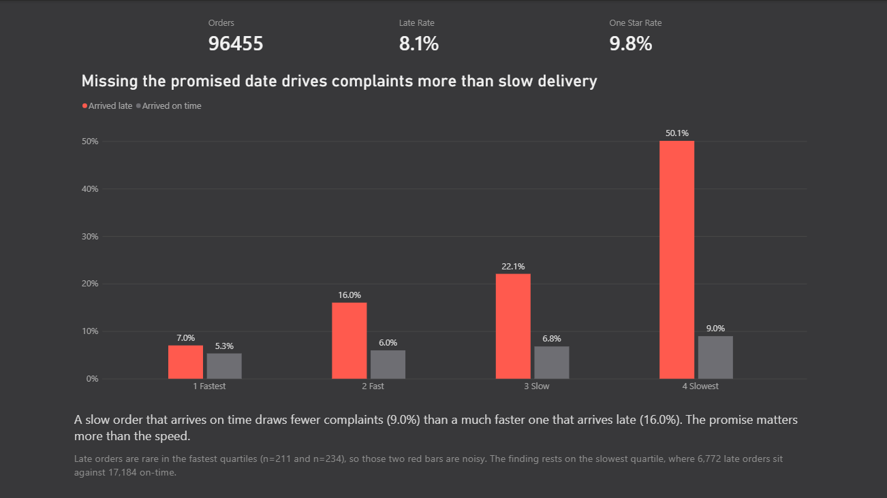
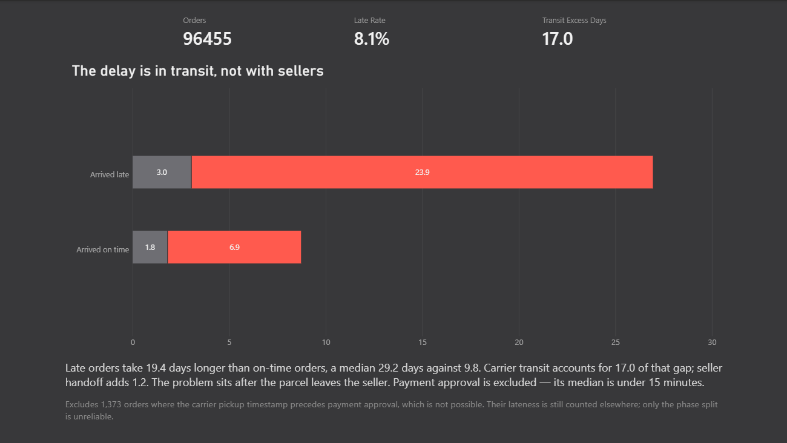
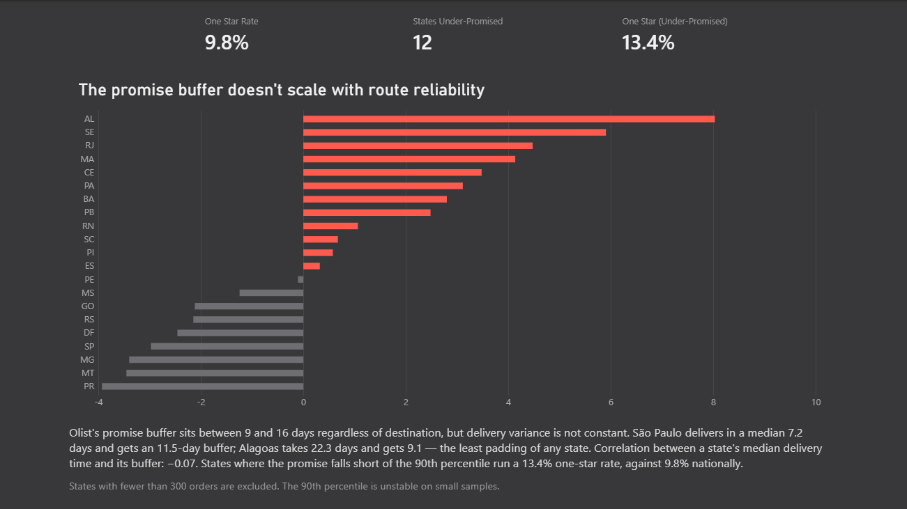

# 📦 Delivery Promises vs Delivery Speed — Power BI Analysis


A Power BI portfolio project analyzing 96,455 real marketplace deliveries to
settle a question with two plausible answers and two very different price
tags: when a delivery disappoints a customer, are they reacting to how long
it took, or to the promise that was broken?

## 📘 Background

Olist is a Brazilian e-commerce marketplace connecting small sellers to the
major retail platforms. Between September 2016 and October 2018 it recorded
roughly 100,000 orders, each carrying something most transaction datasets
lack: `order_estimated_delivery_date`, the delivery date the customer was
shown at checkout, alongside the date the parcel actually arrived and the
review score they left afterwards.

That combination makes a specific question answerable. Slow delivery and late
delivery are usually measured as the same thing, but they are not, and they
imply opposite responses:

- If reviews track **absolute delivery time**, the fix is logistics — faster
  carriers, closer warehouses, more distribution centres. Expensive, slow,
  capital-intensive.
- If reviews track **the gap against the promise**, the fix is the estimate
  itself. A number in a form field.

Both are plausible before looking. The data separates them cleanly.

## 🎯 Objective

1. Determine whether customer complaints follow **delivery duration** or
   **promise accuracy**, and by how much.
2. If lateness is the driver, locate **which stage of fulfilment** produces
   the delay — payment, seller handoff, or carrier transit — so the finding
   points at a team rather than at "logistics".
3. Test whether that delay is **predictable in advance**, since a fix to the
   estimate only works if the variation can be anticipated.
4. Check whether Olist's existing delivery estimate already accounts for it.
5. Verify that the dataset can support the question **before** building
   anything on it, rather than after.

## 🗂️ Dataset

**Source:** [Brazilian E-Commerce Public Dataset by Olist](https://www.kaggle.com/datasets/olistbr/brazilian-ecommerce)
— nine linked tables, ~100k orders, September 2016 – October 2018.

Four of the nine tables feed this analysis. The fact table is built at
one-row-per-delivered-order by
[`src/build_model.py`](src/build_model.py):

| Column | Type | Description |
|---|---|---|
| `order_id` | `VARCHAR` | Unique order identifier |
| `purchase_date` | `DATE` | When the order was placed |
| `delivery_days` | `DECIMAL` | Purchase → customer receipt, in days |
| `promised_days` | `DECIMAL` | Purchase → the estimate shown at checkout |
| `slack_days` | `DECIMAL` | Estimate − actual. Negative = promise missed |
| `approval_days` | `DECIMAL` | Phase 1: purchase → payment approval |
| `handoff_days` | `DECIMAL` | Phase 2: approval → carrier collection |
| `transit_days` | `DECIMAL` | Phase 3: carrier collection → customer |
| `is_late` | `INT` | `1` where `slack_days < 0` |
| `review_score` | `INT` | 1–5, one review per order |
| `is_one_star` | `INT` | `1` where `review_score = 1` |
| `data_quality_flag` | `VARCHAR` | `negative_phase` where timestamps are impossible |

Plus `dim_customer`, `dim_seller`, and a generated `dim_date`.

**Important nuance:** `order_estimated_delivery_date` carries no time
component — Olist stores the promise as a *day*, not a moment. Lateness is
therefore measured against midnight on the promised date, meaning an order
delivered at 3pm on its estimated date counts as late. This is a deliberate
convention rather than an oversight, and it affects only boundary cases: the
late group runs 19 days over, not hours.

**Why the data is transformed in Python rather than Power Query:** both work
at this scale, and performance is not the reason. The business definitions —
what counts as late, which orders belong in the population, how a multi-item
order is represented — sit in a script so they can be diffed in version
control and rerun by someone without Power BI installed. Inside a `.pbix`
they would live in a binary file that git cannot read.

## ⚙️ Tools

- **Power BI Desktop** — star schema model, DAX measures, three report pages
- **Python** (pandas, NumPy) — transformation layer and pre-build validation
- **DAX** — `CALCULATE`, `PERCENTILE.INC`, `KEEPFILTERS`, iterated filters
  over `VALUES()`. Every measure is reproduced in
  [`src/measures.dax`](src/measures.dax), since a `.pbix` is a binary file
  and the logic inside it is otherwise unreadable without Power BI.

## 📂 Project Structure

```
olist-delivery-promises/
├── README.md
├── src/
│   ├── build_model.py                  -- raw CSVs → four model tables
│   └── measures.dax                    -- all DAX measures, readable
├── requirements.txt
├── data/
│   ├── raw/                            -- nine Kaggle CSVs (gitignored)
│   └── processed/                      -- script output (gitignored)
├── olist_delivery_promises.pbix        -- model, measures, report
└── assets/
    ├── olist_delivery_promises_banner.png
    ├── promise_vs_speed.png
    ├── where_the_delay_is.png
    └── the_buffer_gap.png
```

## 📊 Analysis Walkthrough

### Step 0 — Check the data can answer the question

Before building anything, four checks on whether the question was viable:
whether the estimate is padded so heavily that lateness is rare, whether the
review distribution can move, whether speed and lateness are separable, and
whether order status quietly mixes populations.

The estimates are padded — median promise 23.2 days against median actual
10.2 — but **8.1% of orders still run late**, which is 7,825 orders. Review
scores are heavily skewed (59% are 5-star), so mean score is useless as an
outcome variable and the **1-star rate** is used throughout instead. Delivery
duration and slack correlate −0.60: related, but nowhere near collinear, so
the two hypotheses can be told apart.

The question survived. Everything below rests on that.

### Step 1 — Does the complaint follow the wait, or the broken promise?

Splitting orders into delivery-speed quartiles and then by whether the
promise was kept separates the two effects.



| Delivery speed | 1-star, arrived on time | 1-star, arrived late |
|---|---|---|
| Fastest 25% | 5.3% | 7.0% |
| Fast | 6.0% | 16.0% |
| Slow | 6.8% | 22.1% |
| Slowest 25% | 9.0% | 50.1% |

**The decisive comparison is not the widest gap, it's the diagonal.** A slow
order that arrived on time draws 9.0% one-star reviews. A much faster order
that arrived late draws 16.0% — nearly double the complaint rate despite
reaching the customer far sooner.

Speed alone moves the rate from 5.3% to 9.0%. Missing the promise moves it
from 9.0% to 50.1%. Customers tolerate a long wait they were told about and
punish a broken commitment.

### Step 2 — Where in fulfilment does the delay happen?

If lateness is what matters, the next question is who owns it. Splitting the
customer's wait into three phases — payment approval, seller-to-carrier
handoff, and carrier transit — points at a specific team.



| Phase | On-time orders | Late orders | Excess |
|---|---|---|---|
| Payment approval | 0.01 days | 0.02 days | ~0 |
| Seller → carrier | 1.8 days | 3.0 days | +1.2 |
| Carrier transit | 6.9 days | 23.9 days | **+17.0** |
| **Total** | **9.8 days** | **29.2 days** | **+19.4** |

The delay sits **after the parcel leaves the seller**. That matters because
the intuitive suspect is the small seller who ships slowly, and the data says
otherwise — handoff contributes 1.2 days of a 19.4-day gap.

*Note: the phase medians do not sum to the total. The order sitting at the
median for transit is not the order sitting at the median for handoff, so
medians are not additive. This is reported as a decomposition, not a
partition.*

### Step 3 — Is the delay predictable?

A fix to the estimate only works if transit variation can be anticipated at
checkout. Median delivery time runs from **7.2 days to São Paulo** to **22.3
days to Alagoas** — a four-fold spread that tracks geography, not chance.

State-level transit time correlates **0.75** with the late rate, which in
turn correlates **0.87** with the one-star rate. The chain holds end to end.

### Step 4 — Does the promise already account for it?

Olist does adjust the estimate by region — 18.7 days promised to São Paulo,
31.4 to Alagoas. The question is whether it adjusts *enough*.



`Buffer Shortfall` measures how far each state's promise falls short of its
own 90th-percentile delivery. Positive means under-promised; negative means
the route is over-padded and could commit to a sooner date.

| State | Median delivery | Promise buffer |
|---|---|---|
| São Paulo | 7.2 days | 11.5 days |
| Rio de Janeiro | 12.0 days | 12.6 days |
| Pará | 21.1 days | 15.0 days |
| Alagoas | 22.3 days | **9.1 days** |

The buffer sits between 9 and 16 days regardless of destination. Correlation
between a state's median delivery time and the padding it receives:
**−0.07**. The safety margin is not merely failing to scale with route
difficulty — it is slightly **inverted**. Alagoas is the slowest and most
variable route in the country and receives the least protection of any state.

Twelve states currently promise dates their own 90th-percentile order cannot
meet. Those states run a **13.4% one-star rate against 9.8% nationally**.

## 🔑 Key Takeaways

- **The promise matters more than the speed.** A slow-but-on-time order
  (9.0% one-star) outperforms a fast-but-late one (16.0%). Complaint rate is
  driven by expectation, not duration.
- **The delay is in carrier transit, not seller handoff.** 17.0 days of a
  19.4-day gap occur after collection; sellers contribute 1.2. The intuitive
  culprit is the wrong one.
- **The variation is predictable.** A four-fold spread in delivery time by
  destination, correlating 0.75 with lateness and 0.87 with complaints.
- **The estimate ignores all of it.** A near-flat 9–16 day buffer applied to
  routes ranging from 7 to 22 days, correlating −0.07 with route difficulty.
- **The recommendation is free.** Set the buffer from route variance rather
  than as a constant margin. Alagoas needs ~8 more days to cover its 90th
  percentile; São Paulo and Paraná could promise 3–4 days *sooner* and still
  cover theirs. No change to the logistics network required.

## ▶️ How to Reproduce

```bash
# 1. Download the nine CSVs from Kaggle into data/raw/
#    https://www.kaggle.com/datasets/olistbr/brazilian-ecommerce

# 2. Build the model tables
pip install -r requirements.txt
python src/build_model.py --raw data/raw --out data/processed

# 3. Open olist_delivery_promises.pbix and refresh against data/processed/
```

The script prints rows kept, dropped, and flagged on every run, so the
population is auditable rather than assumed.

## ⚠️ Caveats

- **The relationship is associational, not causal.** A late order may travel
  with other problems — wrong item, damage, an unresponsive seller — and the
  review responds to all of them. The size of the gap makes delivery timing
  the most plausible driver, but this is not a controlled estimate.
- **Late orders are rare in the fastest quartiles** (n=211 and n=234), so
  those two bars are noisy. The finding rests on the slowest quartile, where
  6,772 late orders sit against 17,184 on-time.
- **1,373 orders record a carrier pickup timestamp before payment approval**,
  which is impossible. They are flagged rather than deleted — their lateness
  is still trustworthy, only the phase split is not — and excluded from the
  Step 2 measures only.
- **States with fewer than 300 orders are excluded** from Step 4. A 90th
  percentile computed on 46 orders (Roraima) is not meaningful.
- **646 orders have no review.** Rate measures divide by reviewed orders, not
  by all orders.
- **Medians throughout, not means.** Delivery times have a long right tail
  (maximum 209 days) and means chase the outliers.
- **The data predates the pandemic.** This does not affect the finding: the
  question is how customers respond to a broken expectation, which is a fact
  about expectations rather than about 2018 Brazilian e-commerce volumes.

---

**Author:** Aditya Raj Majumder  
🎓 Data Analyst  
🔗 [LinkedIn](https://www.linkedin.com/in/aditya-raj-majumder-600533250/) | [GitHub](https://github.com/Aditya-Raj-Majumder)
