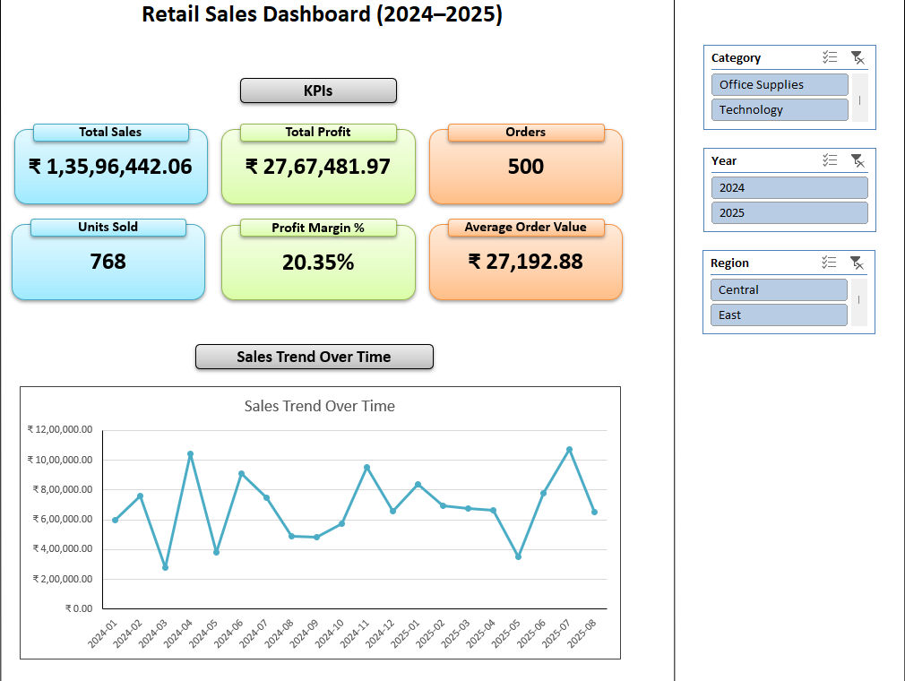
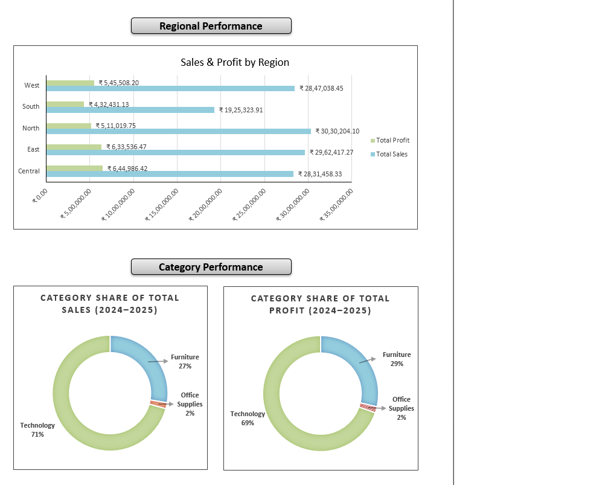
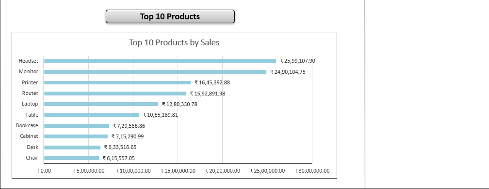

# 🧮 Retail Sales Dashboard (Excel)
 
An interactive Excel dashboard built over a 500-row synthetic retail transaction dataset,
covering sales and profit by region, category, product, and month.
 
**A note on scope:** the dataset was generated for practice, not drawn from a real business.
This project therefore demonstrates dashboard construction and data cleaning in Excel; the
figures it displays are not findings and are not presented as any.

## 📸 Dashboard Preview

## ⚙️ What This Project Demonstrates
 
- **Data cleaning** — loaded the source table through Power Query and coerced column types
  (text, integer, decimal, date) so the pivots aggregate on real numbers and dates rather than
  text, then derived `Year`, `Month`, and `YearMonth` columns for time-series grouping.
- **Dashboard construction** — PivotTable-driven layout with slicers for region, category, and
  period, so a single view answers several questions without rebuilding.
- **Visual encoding** — conditional formatting and chart selection matched to the comparison
  being made (rank, share, trend).
- **Layered workbook structure** — raw data, cleaned data, pivots, and presentation held on
  separate sheets so the dashboard recalculates from source rather than from pasted values.
**What I'd change:** the `Year`, `Month`, and `YearMonth` columns are worksheet formulas sitting
beside the query output rather than steps inside the query itself, so a refresh with new rows
leaves them blank until they're filled down manually. Adding them in Power Query would make the
workbook genuinely refreshable.
 
## 📊 About the Data
 
The dataset is synthetic — 500 generated transactions across five regions, three categories,
and 20 months. Two properties are worth knowing before reusing it:
 
- **Cost is drawn independently of everything else.** `Cost ÷ Sales` is a uniform draw between
  0.65 and 0.95, unrelated to price, quantity, category, region, or period. Profit margin is
  therefore flat by construction (~20% overall), and margin comparisons across any dimension
  return noise.
- **Discount and margin are algebraically locked.** `Sales` is already net of discount, and
  `Cost` is a fraction of that post-discount figure, so discounting cannot move margin in this
  data. Mean cost ratio by tier: 0.798 at no discount, 0.793 at 5%, 0.795 at 10%, 0.775 at 15%.
Category revenue share follows the same logic: order counts are near-equal at 164, 172, and
164, while unit prices are banded at roughly ₹100–2,000 for Office Supplies, ₹2,000–25,000 for
Furniture, and ₹3,000–80,000 for Technology. Technology's ~71% revenue share reflects that
price band, not demand.
 
## 🧰 Tools Used
 
Microsoft Excel — Power Query, PivotTables, slicers, conditional formatting
 
## 📂 File Contents
 
| File | Description |
|------|-------------|
| `Retail_Sales_Dashboard_Aditya.xlsx` | Workbook containing raw data, cleaned data, pivots, and the dashboard. |
| `dashboard_top.png`, `dashboard_middle.png`, `dashboard_bottom.png` | Dashboard screenshots for preview. |
| `README.md` | This file. |
 
---
 
**Author:** Aditya Raj Majumder  
🎓 Data Analyst  
🔗 [LinkedIn](https://www.linkedin.com/in/aditya-raj-majumder-600533250/) | [GitHub](https://github.com/Aditya-Raj-Majumder)
